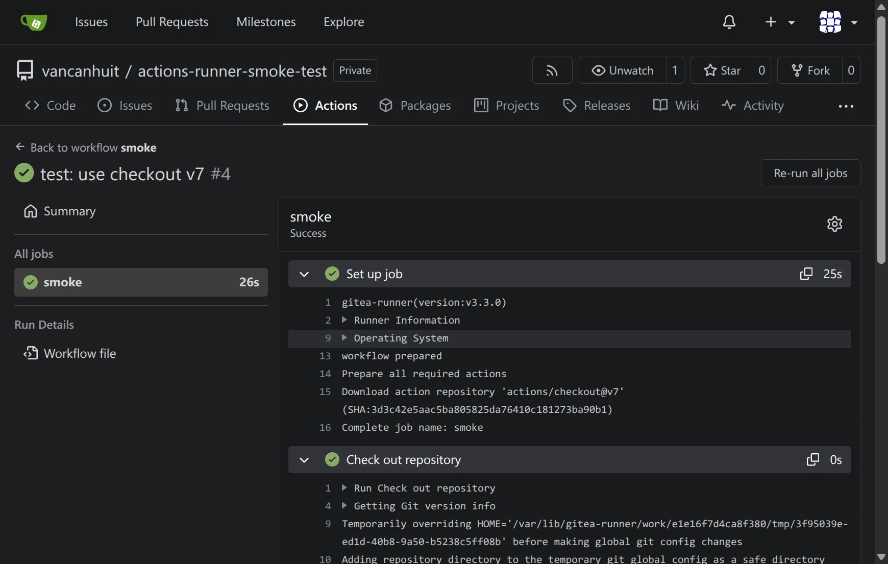
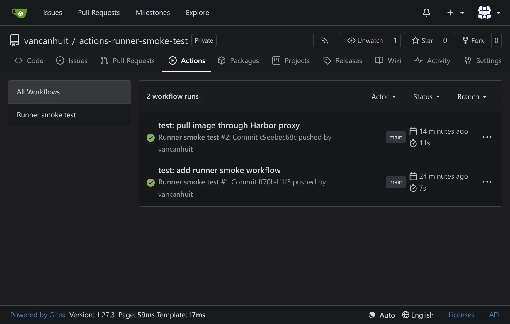
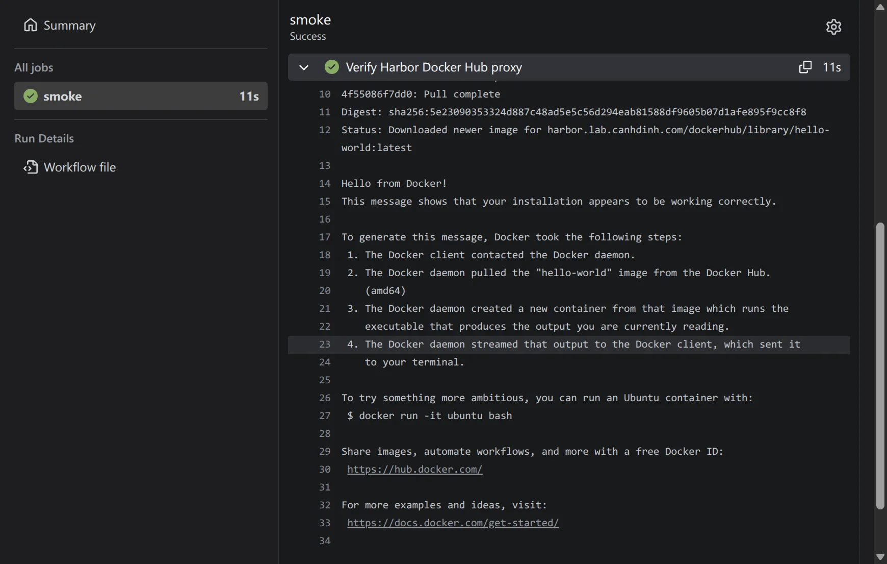

# Gitea Actions runner

The instance-wide Gitea Actions runner uses a dedicated Debian 13 Incus virtual machine. Jobs selected with `runs-on: debian-amd64` execute directly on that VM under the `gitea-runner` system account.

The account is not a sudoer, but membership in the `docker` group grants effective root control of the runner VM through the Docker daemon. Only trusted personal repositories should use this runner. The VM is the security boundary between workflows and the rest of the homelab.

## Provision the VM

Create a DHCP-enabled VM with two CPUs, 4 GiB RAM, a 20 GiB root disk, and a dedicated 100 GiB block volume:

```sh
uv run create-incus-instance.py gitea-runner \
  --vm \
  --dhcp \
  --storage-pool pool1 \
  --storage-size 100GiB \
  --storage-type block
incus config set gitea-runner limits.cpu=2 limits.memory=4GiB
incus config device set gitea-runner root size=20GiB
incus start gitea-runner
```

Create a stable Technitium DHCP reservation for the VM and a private A record for `gitea-runner.lab.canhdinh.com`. Confirm that SSH and HTTPS access to `gitea.lab.canhdinh.com` work from the VM before deployment.

The role recognizes the dedicated disk by `/dev/disk/by-id/scsi-0QEMU_QEMU_HARDDISK_incus_data`, creates ext4 only when the disk is unformatted, and mounts it by filesystem UUID at `/var/lib/docker`. It refuses a disk containing another filesystem or mounted at another path. Containerd stores its image snapshots under `/var/lib/docker/containerd`, keeping Docker state off the VM root disk.

## Deploy and verify

Run from `ansible/`:

```sh
ansible-playbook gitea-runner.yaml
ansible-playbook verify-gitea-runner.yaml
ansible-playbook gitea-runner.yaml
```

The playbook obtains the global registration token directly from Gitea as the `git` account, passes it only during first registration, and removes the temporary token file. The persistent `/var/lib/gitea-runner/.runner` file contains the runner identity and API credentials and is restricted to mode `0600`.

The deployment installs Gitea Runner 3.3.0, Node.js 24 LTS from NodeSource, Docker Engine, Buildx, Compose, Git LFS, build tools, and common command-line utilities.

## Use the runner

Enable Actions in each existing repository that should run workflows. New repositories include the Actions unit by default. Add workflow files under `.gitea/workflows/` and select the host runner explicitly:

```yaml
name: Runner smoke test

on:
  push:
  workflow_dispatch:

jobs:
  smoke:
    runs-on: debian-amd64
    steps:
      - name: Check out repository
        uses: actions/checkout@v7
      - name: Verify checkout
        run: test -f .gitea/workflows/smoke.yml
      - name: Verify host runner
        run: |
          test "$(id -un)" = gitea-runner
          git --version
          docker version
      - name: Verify Harbor Docker Hub proxy
        run: docker run --rm harbor.lab.canhdinh.com/dockerhub/library/hello-world:latest
```

Do not use `ubuntu-latest` as an alias for this runner. The explicit `debian-amd64:host` registration label prevents workflows written for disposable GitHub-hosted runners from accidentally executing on the persistent VM.

The runner includes Node.js 24 LTS for JavaScript actions. A successful `actions/checkout@v7` step downloads the action, fetches the repository from Gitea, and checks out the workflow commit:



The repository Actions page lists workflow runs and their result, trigger, branch, commit, and duration:



## Smoke test

The `actions-runner-smoke-test` repository verifies host execution, Docker access, and the Harbor Docker Hub proxy cache. Its workflow runs this image through the proxy project:

```sh
docker run --rm harbor.lab.canhdinh.com/dockerhub/library/hello-world:latest
```

Open a run and expand a step to inspect its logs. A successful proxy test shows the image pulled from `harbor.lab.canhdinh.com/dockerhub` and the `Hello from Docker!` output:



## Operations

Inspect the service and logs:

```sh
sudo systemctl status gitea-runner.service docker.service
sudo journalctl -u gitea-runner.service
curl --fail http://127.0.0.1:9101/readyz
```

The runner has capacity one. Host jobs can leave files, processes, images, and other state behind; the runner performs its normal workspace cleanup, but the VM is not reset after each job.

To upgrade, update `gitea_runner_version` and `gitea_runner_checksum` together after reviewing the [runner upgrade guide](https://docs.gitea.com/runner/upgrade/) and release notes. The registration file remains valid across upgrades.
