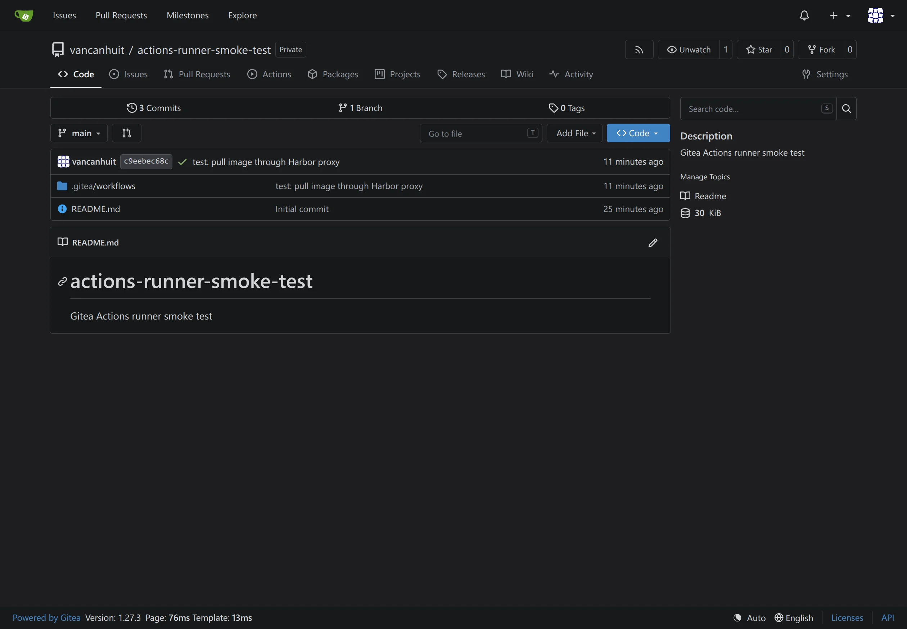

# Gitea operations

## First login

Open `https://gitea.lab.canhdinh.com/` and sign in as `gitea-admin`. The initial password is stored in the SOPS key `gitea_admin_password`; Gitea requires an immediate password change on first login.

User registration is enabled, and new accounts must confirm their email address through the configured Brevo transactional mail service.

## Repository interface

Repositories expose source browsing, issues, pull requests, Actions, packages, projects, releases, and other enabled units from the repository navigation bar.



## Health checks

Run these commands on the Gitea host:

```sh
sudo systemctl status gitea.service
sudo journalctl -u gitea.service --since today
sudo -u git /usr/local/bin/gitea doctor check --default --config /etc/gitea/app.ini
sudo systemctl status lego-renew.timer
```

## Local data volume

`/var/lib/gitea` is mounted from the Incus filesystem volume `pool1/gitea-data`
with a 20 GiB quota. It holds repositories and generated state outside the
container root disk. PostgreSQL and S3 data remain on their respective services.
Both the deployment role and systemd require this mount before starting Gitea.
Instance snapshots do not include custom volumes; back up this volume separately.

### Migrate an existing root-disk deployment

Run Incus commands from the administrator workstation against `homelab-server`.
This procedure requires a running `gitea` container and a maintenance window.
For a new container, use the [provisioning command](incus.md#create-incus-instances).
Do not repeat this migration after the volume is attached at `/var/lib/gitea`.

1. Create the volume and attach it at a staging path:

   ```sh
   incus storage volume create homelab-server:pool1 gitea-data size=20GiB
   incus config device add homelab-server:gitea data disk \
     pool=pool1 source=gitea-data path=/mnt/gitea-data
   ```

2. Stop Gitea, prevent automatic restarts during the copy, and verify the data.
   Stop if any command fails; leave Gitea stopped until the copy is verified.

   ```sh
   incus exec homelab-server:gitea -- sh -eu -c '
     mountpoint --quiet /mnt/gitea-data
     test ! -e /var/lib/gitea.root-disk-backup
     systemctl mask --runtime --now gitea.service
     test "$(systemctl is-active gitea.service)" = inactive
     cp -a /var/lib/gitea/. /mnt/gitea-data/
     diff -qr --no-dereference /var/lib/gitea /mnt/gitea-data
     sync
     mv /var/lib/gitea /var/lib/gitea.root-disk-backup
     mkdir /var/lib/gitea
   '
   ```

3. Switch the mount and verify it before allowing Gitea to start:

   ```sh
   incus config device set homelab-server:gitea data path=/var/lib/gitea
   incus exec homelab-server:gitea -- sh -eu -c '
     mountpoint --quiet /var/lib/gitea
     diff -qr --no-dereference /var/lib/gitea.root-disk-backup /var/lib/gitea
     findmnt -M /var/lib/gitea
     systemctl unmask --runtime gitea.service
   '
   ```

4. From `ansible/`, deploy the mount guards and verify service health:

   ```sh
   mise exec -- ansible-playbook gitea.yaml --limit gitea
   mise exec -- ansible-playbook verify-gitea.yaml
   mise exec -- ansible-playbook gitea.yaml --limit gitea
   ```

   The final deployment should report `changed=0`. Confirm the source is
   `pool1/custom/default_gitea-data` with `findmnt -M /var/lib/gitea` inside the
   container, and confirm the quota with
   `incus storage volume get homelab-server:pool1 gitea-data size`.

The migration on 2026-09-19 temporarily retained
`/var/lib/gitea.root-disk-backup` for rollback. That copy was removed the same day
after verifying the data-volume mount and application health. For future
migrations, remove the copy only after accepting the migration; it becomes stale
as soon as Gitea resumes writing.

### Recovery

Before cutover, the root-disk source is intact: fix the staging copy or unmask and
start Gitea against the original directory. After cutover, prefer repairing the
`data` device attachment and keeping the current volume. If switching storage
again, stop and runtime-mask Gitea, copy and verify its latest data first, and
provide a mount at `/var/lib/gitea` before restarting. Do not restore the stale
root-disk copy over newer data or bypass the mount guards.

## Object storage

Gitea uses the local SeaweedFS S3-compatible API as its object-storage backend. It stores LFS objects, user and repository avatars, attachments, repository archives, packages, Actions logs, and Actions artifacts in the `homelab-gitea` bucket. Git repository object data remains under `/var/lib/gitea` on the Gitea host.

SeaweedFS grants Gitea a bucket-scoped identity with read, list, tagging, and write access only to `homelab-gitea`. The SeaweedFS administrative identity is separate and is not deployed to the Gitea host. Both hosts need their own encrypted copy of the shared Gitea identity: Gitea uses it as an S3 client, while SeaweedFS uses it to define the server-side authorization policy.

Run `ansible-playbook verify-gitea.yaml` after storage configuration changes. Do not inspect `/etc/gitea/app.ini` in shared or recorded terminals because it contains object-storage credentials.

The migration from Backblaze to SeaweedFS was manually verified on 2026-09-12. A comparison performed while writes were frozen found two matching objects totaling 4,887 bytes and no content differences. Confirm the former Backblaze bucket still exists and remains suitable before treating it as a rollback source.

Changing storage providers requires data migration as well as configuration deployment:

1. Copy the existing bucket to the destination while Gitea remains online.
2. Stop Gitea to freeze object writes.
3. Copy the final delta and compare object counts, byte totals, and contents.
4. Update the `gitea_s3_*` inventory values and run `ansible-playbook gitea.yaml`.
5. Run `ansible-playbook verify-gitea.yaml` and test existing object-backed content through Gitea.
6. Retain the source bucket for a rollback period.

To roll back during that period, stop Gitea and sync the final SeaweedFS delta back to Backblaze. Verify the object count, byte total, and contents before changing the inventory. Restore `gitea_s3_endpoint` to `s3.us-west-004.backblazeb2.com`, `gitea_s3_region` to `us-west-004`, and `gitea_s3_bucket_lookup_type` to `auto`. Then run `ansible-playbook gitea.yaml --limit gitea` and `ansible-playbook verify-gitea.yaml`. Do not switch the endpoint before the reverse sync passes.

## Upgrade procedure

Stop Gitea and take a consistent backup before changing `gitea_version`:

```sh
sudo systemctl stop gitea.service
```

Do not upgrade until you accept the repository and generated-state backup limitation described under [Backup coverage](backups-and-postgresql.md#backup-coverage). A Gitea upgrade also requires updating the supported-version assertion in `roles/gitea/tasks/validate.yaml`, the expected version in `verify-gitea.yaml`, and the version expectations in `roles/gitea/tests/render-config.yml`. Then run the role test, deployment, and verification playbook.
