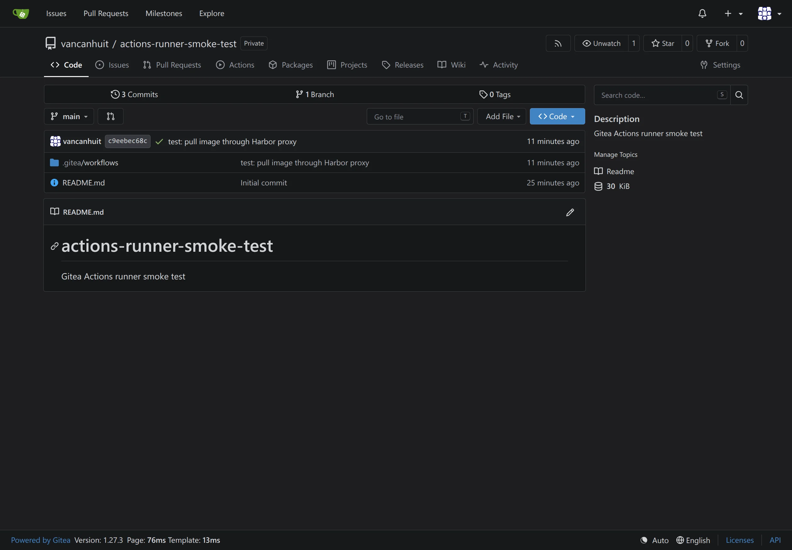

# Gitea operations

## First login

Open `https://gitea.lab.canhdinh.com/` and sign in as `gitea-admin`. The initial password is stored in the SOPS key `gitea_admin_password`; Gitea requires an immediate password change on first login.

User registration is enabled, and new accounts must confirm their email address through the configured Brevo transactional mail service.

## Repository interface

Use the repository navigation bar to browse source, issues, pull requests,
Actions, packages, projects, releases, and other enabled units.



## Health checks

Run these commands on the Gitea host:

```sh
sudo systemctl status gitea.service
sudo journalctl -u gitea.service --since today
sudo -u git /usr/local/bin/gitea doctor check \
  --run check-db-consistency --run hooks --run storages \
  --config /etc/gitea/app.ini
sudo systemctl status lego-renew.timer
```

## Local data volume

`/var/lib/gitea` is mounted from the Incus filesystem volume `pool1/gitea-data`
with a 20 GiB quota. It holds repositories and generated state outside the
container root disk. PostgreSQL and S3 data remain on their respective services.
Both the deployment role and systemd require this mount before starting Gitea.
Instance snapshots do not include custom volumes; back up this volume separately.

### Migrate an existing root-disk deployment

Run Incus commands from the administrator workstation against `homelab-server`.
This procedure requires a running `gitea` container and a maintenance window.
For a new container, use the [provisioning command](incus.md#create-incus-instances).
Do not repeat this migration after the volume is attached at `/var/lib/gitea`.

1. Create the volume and attach it at a staging path:

   ```sh
   incus storage volume create homelab-server:pool1 gitea-data size=20GiB
   incus config device add homelab-server:gitea data disk \
     pool=pool1 source=gitea-data path=/mnt/gitea-data
   ```

2. Stop Gitea, prevent automatic restarts during the copy, and verify the data.
   Stop if any command fails; leave Gitea stopped until the copy is verified.

   ```sh
   incus exec homelab-server:gitea -- sh -eu -c '
     mountpoint --quiet /mnt/gitea-data
     test ! -e /var/lib/gitea.root-disk-backup
     systemctl mask --runtime --now gitea.service
     test "$(systemctl is-active gitea.service)" = inactive
     cp -a /var/lib/gitea/. /mnt/gitea-data/
     diff -qr --no-dereference /var/lib/gitea /mnt/gitea-data
     sync
     mv /var/lib/gitea /var/lib/gitea.root-disk-backup
     mkdir /var/lib/gitea
   '
   ```

3. Switch the mount and verify it before allowing Gitea to start:

   ```sh
   incus config device set homelab-server:gitea data path=/var/lib/gitea
   incus exec homelab-server:gitea -- sh -eu -c '
     mountpoint --quiet /var/lib/gitea
     diff -qr --no-dereference /var/lib/gitea.root-disk-backup /var/lib/gitea
     findmnt -M /var/lib/gitea
     systemctl unmask --runtime gitea.service
   '
   ```

4. From `ansible/`, deploy the mount guards and verify service health:

   ```sh
   mise exec -- ansible-playbook gitea.yaml --limit gitea
   mise exec -- ansible-playbook verify-gitea.yaml
   mise exec -- ansible-playbook gitea.yaml --limit gitea
   ```

   The final deployment should report `changed=0`. Confirm the source is
   `pool1/custom/default_gitea-data` with `findmnt -M /var/lib/gitea` inside the
   container, and confirm the quota with
   `incus storage volume get homelab-server:pool1 gitea-data size`.

The migration on 2026-09-19 temporarily retained
`/var/lib/gitea.root-disk-backup` for rollback. That copy was removed the same day
after verifying the data-volume mount and application health. For future
migrations, remove the copy only after accepting the migration; it becomes stale
as soon as Gitea resumes writing.

### Recovery

Before cutover, the root-disk source is intact: fix the staging copy or unmask and
start Gitea against the original directory. After cutover, prefer repairing the
`data` device attachment and keeping the current volume. If switching storage
again, stop and runtime-mask Gitea, copy and verify its latest data first, and
provide a mount at `/var/lib/gitea` before restarting. Do not restore the stale
root-disk copy over newer data or bypass the mount guards.

## Object storage

Gitea stores LFS objects, user and repository avatars, attachments, repository
archives, packages, Actions logs, and Actions artifacts in the `homelab-gitea`
bucket through the local SeaweedFS S3-compatible API. Git repository object data
remains under `/var/lib/gitea` on the Gitea host.

SeaweedFS grants Gitea a bucket-scoped identity with read, list, tagging, and write
access only to `homelab-gitea`. The separate SeaweedFS administrative identity is
not deployed to the Gitea host. Both hosts need an encrypted copy of the shared
Gitea identity. Gitea uses it as an S3 client; SeaweedFS uses it to define the
server-side authorization policy.

Run `ansible-playbook verify-gitea.yaml` after storage configuration changes. Do not inspect `/etc/gitea/app.ini` in shared or recorded terminals because it contains object-storage credentials.

The migration from Backblaze to SeaweedFS was manually verified on 2026-09-12. A comparison performed while writes were frozen found two matching objects totaling 4,887 bytes and no content differences. Confirm the former Backblaze bucket still exists and remains suitable before treating it as a rollback source.

Changing storage providers requires data migration as well as configuration deployment:

1. Copy the existing bucket to the destination while Gitea remains online.
2. Stop Gitea to freeze object writes.
3. Copy the final delta and compare object counts, byte totals, and contents.
4. Update the `gitea_s3_*` inventory values and run `ansible-playbook gitea.yaml`.
5. Run `ansible-playbook verify-gitea.yaml` and test existing object-backed content through Gitea.
6. Retain the source bucket for a rollback period.

To roll back during that period, stop Gitea and sync the final SeaweedFS delta back to Backblaze. Verify the object count, byte total, and contents before changing the inventory. Restore `gitea_s3_endpoint` to `s3.us-west-004.backblazeb2.com`, `gitea_s3_region` to `us-west-004`, and `gitea_s3_bucket_lookup_type` to `auto`. Then run `ansible-playbook gitea.yaml --limit gitea` and `ansible-playbook verify-gitea.yaml`. Do not switch the endpoint before the reverse sync passes.

## Upgrade procedure

Review the target release's breaking changes, drain Actions jobs, and stop the
runner before stopping Gitea. Stop the certificate renewal timer and any active
renewal service so its deploy hook cannot restart Gitea during the backup.

On the runner host:

```sh
sudo systemctl stop gitea-runner.service
```

On the Gitea host:

```sh
sudo systemctl stop lego-renew.timer lego-renew.service
sudo systemctl stop gitea.service
```

While Gitea remains stopped, back up the `gitea` PostgreSQL database with native
`pg_dump`, the `pool1/gitea-data` custom volume, the complete `homelab-gitea`
object bucket, configuration, TLS/ACME state, and the old binary. An instance
snapshot alone does not cover the custom volume or external services. Verify an
encrypted off-host copy and rehearse database migration and restore against a
separate database before deploying. See [Backup coverage](backups-and-postgresql.md#backup-coverage).

Update `gitea_version`, the supported-version assertion in
`roles/gitea/tasks/validate.yaml`, the expected version in `verify-gitea.yaml`, and
the version expectations in both `roles/gitea/tests/render-config.yml` and
`roles/gitea/tests/release-case.yml`. From `ansible/`, run the focused role test,
syntax checks, and lint before deployment:

```sh
mise exec -- ansible-playbook -i localhost, roles/gitea/tests/render-config.yml
mise exec -- ansible-playbook --syntax-check gitea.yaml
mise exec -- ansible-playbook --syntax-check verify-gitea.yaml
mise exec -- ansible-lint roles/gitea gitea.yaml verify-gitea.yaml
mise exec -- ansible-playbook gitea.yaml --limit gitea
mise exec -- ansible-playbook verify-gitea.yaml
```

The deployment restarts Gitea and starts database migrations automatically.
After application checks pass, start the runner, run its smoke workflow, and
run `verify-gitea-runner.yaml`. Rerun `gitea.yaml --limit gitea` and require
`changed=0`. The deployment resumes `lego-renew.timer`.

For rollback, stop Gitea and the runner and restore the matching pre-upgrade
database, repository volume, object bucket, binary, and configuration. Restore
only the `gitea` database: a whole-cluster PostgreSQL rollback would also rewind
Harbor. An old binary cannot use a database migrated to a newer release. A
rollback to the backup discards writes accepted after the backup timestamp.

### Gitea 28.0.0 upgrade, 2026-09-30

Gitea was upgraded from 1.27.3 to [28.0.0](https://blog.gitea.com/release-of-28.0.0/), which
drops the historical `1.` version prefix. The signed amd64 release was verified
against the existing trusted release key. Debian 13's installed Git 2.47.3 meets
the new Git 2.25 minimum.

The configuration explicitly preserves Actions run records with
`RUN_RETENTION_DAYS = 0`; logs and artifacts retain their separate retention
policies. The obsolete `[server] DOMAIN` setting was removed; `ROOT_URL` and
email-confirmed registration remain explicit. There were no mirrors, webhooks,
external login providers, or custom egress lists to migrate. Gitea still serves
HTTPS directly, and a signed-in WebSocket connection to `/-/ws` succeeded.

`doctor --default` selected zero checks, so verification now explicitly runs
database consistency, repository hooks, and storage checks and requires all
three to complete.

The pre-upgrade rollback set is named `pre28-20260930T133943Z`:

| Component | Location |
| --- | --- |
| Gitea root snapshot, no expiry | `homelab-server:gitea/pre28-20260930T133943Z` |
| Gitea custom-volume snapshot, no expiry | `homelab-server:pool1/gitea-data/pre28-20260930T133943Z` |
| Encrypted off-host archive on the administrator workstation | `~/.local/state/homelab-backups/gitea/pre28-20260930T133943Z.tar.age` |
| Matching encrypted archive on the Gitea host | `/var/backups/gitea/pre28-20260930T133943Z.tar.age` |

Archive SHA-256:
`56bf697723779e9b7c2cf7f420deec003fc1b019165c8a7e09a8417f144efd39`.
It is encrypted to the repository's SOPS age recipient and authenticated
decryption was verified. The archive contains `gitea-db.dump`,
`gitea-data.tar.gz`, `gitea-config.tar.gz`, baseline counts, file checksums, and
all eight bucket objects (18,395 bytes). `objects.json` maps each object key to
its numbered payload under `objects/` and records its SHA-256, metadata, and tags.
Decrypt only into a protected directory outside this repository.

The schema migration rehearsal used an isolated database and a copy of the local
working directory, with outbound application integrations disabled and local
storage selected. Migration from 343 to 356 took 2.6 seconds. Restoring the native
dump returned schema 343 and the original counts (two users, one repository, six runs, six tasks);
Gitea 1.27.3 accepted the restored database. The rehearsal database and directory
were removed afterward.

Production verification passed for HTTPS clone/fetch/push, pull-request merge,
LFS upload and fresh download, generic package upload/download, release
attachment upload/download, all eight pre-upgrade object hashes, and rendering
both pre-upgrade and new Actions logs in the browser.
[Actions smoke run #7](https://gitea.lab.canhdinh.com/vancanhuit/actions-runner-smoke-test/actions/runs/7)
succeeded with Runner 4.0.0, builtin checkout, Docker access, and the Harbor
Docker Hub proxy. Temporary repositories, package versions, and access tokens
were removed. Gitea and runner verification passed, and the second deployment
reported `changed=0`.

Plaintext backup staging was removed after the encrypted copies were verified.

Retain the rollback set through several days of normal operation and a
successful backup cycle. This one-time upgrade backup provides no scheduled
off-host protection.
